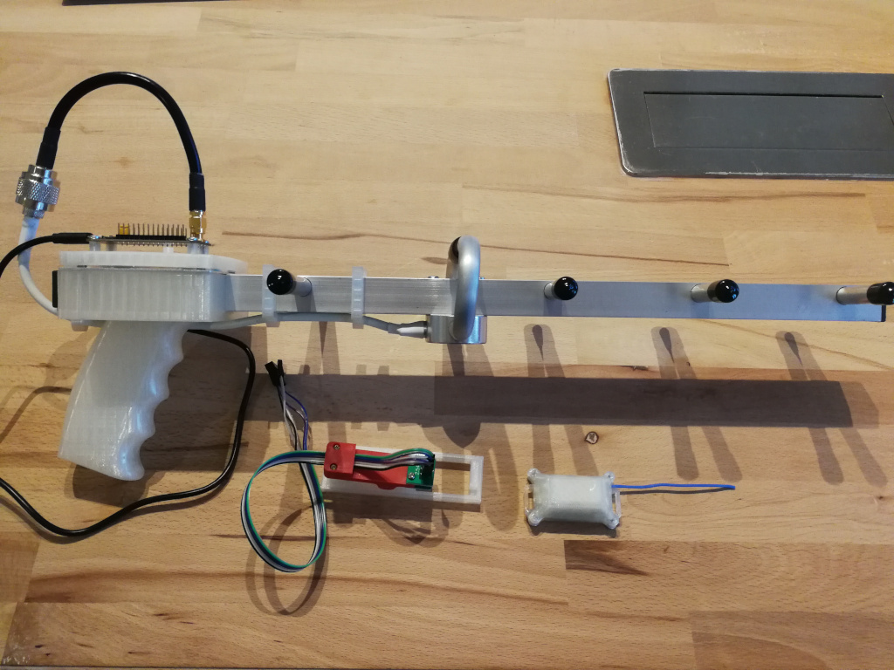

# Cat Tracker



An active RFID system for locating free roaming pets / wildlife. Uses a compact handheld radio direction finding receiver rather than GPS (due to power budget and the need for real-time updates). Kind of a modern take on a traditional wildlife tracker.

## Backstory

My wife and I adopted a free roaming snow bengal cat from a former neighbor. She's a very naughty cat and often decides she wants to spend extended time away from us in the giant wooded park next door.

I've spent many a late night walking in the woods with a kibble bag trying to get her to come home for dinner. I can usually locate her but it's a gigantic PITA.

It would be nice to have a real time GPS position but the commercial tracking collars are bulky (she's a tiny cat), expensive (ongoing fees), and have limited battery life. Of course there is the air tag and tile products, which I think are probably amazing in an urban area but our cat is often found in the dense woods far away from other people.

None of the existing solutions satisfied me so I decided to build my own. It had to be very compact, have a long battery life (months or years), and no ongoing costs.

## Notes

### Edit the Radio Configuration For Your Region

If you are outside the EU you will probably need to modify the radio configuration in [firmware/CatTracker/Base/subghz_radio.h](./firmware/CatTracker/Base/subghz_radio.h) to match your legislative region.

### To Unlock A STM32WLExx

Telnet into the OpenOCD server:

```
telnet localhost 4444
```

And run the following commands:

```
stm32l4x unlock 0
# Clear FLASH_OPTR
stm32l4x option_write 0 0x20 0xbffff0aa
# Power cycle the device
halt
stm32l4x mass_erase 0
```

### To Read The Unique ID From A STM32WLExx

Telnet into the OpenOCD server:

```
telnet localhost 4444
```

And run the following commands:

```
mdw 0x1FFF7590
```

## Errata

### EBYTE E77-900M22S Dev Boards

My boards arrived with a capacitor missing from the lowpass filter before the SMA jack. This meant the antenna jack was completely disconnected.

### PCB

The footprint for the battery holder needs a larger keep out area so that the center pad makes good contact. I temporarily resolved this by raising the pad with some additional solder.
